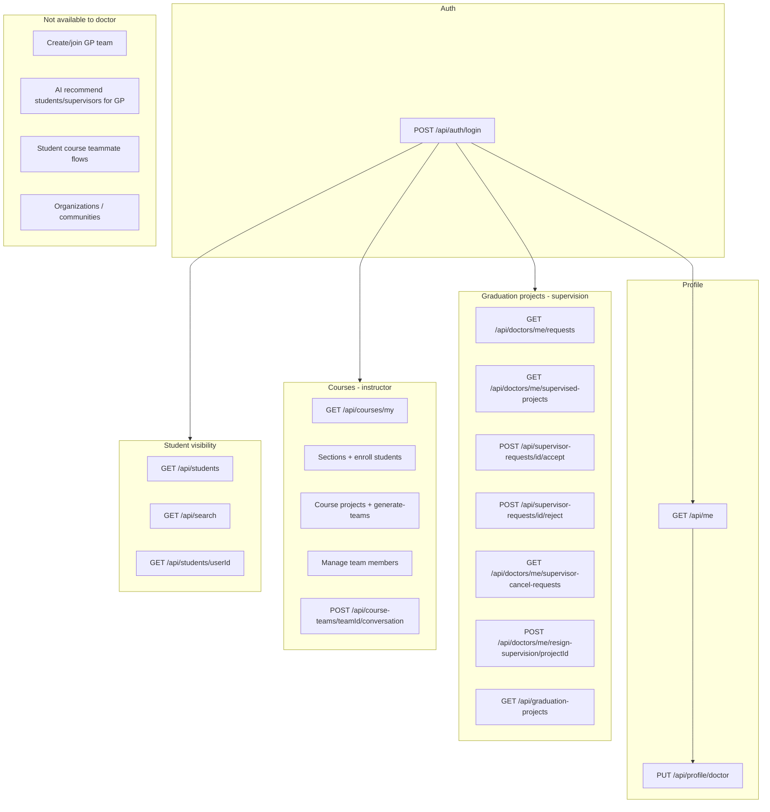

# Doctor Capabilities on Student-Related Backend

This document describes what a **logged-in doctor** (`role: doctor` in the JWT) can do against the **current** `GraduationProject.API` backend, with emphasis on **student graduation projects**, **supervision**, **courses**, and **student profile visibility**.

It is derived from controller code under `backend/GraduationProject.API/Controllers/` and related services—not from frontend assumptions.

---

## Authentication & session

| Endpoint | Doctor access | Notes |
|----------|---------------|-------|
| `POST /api/auth/login` | Yes | Returns JWT with role claim `doctor`. |
| `POST /api/auth/register/doctor` | Public (no login) | Registration only. |
| `POST /api/auth/forgot-password` | Yes | Role-agnostic. |
| `POST /api/auth/reset-password` | Yes | Role-agnostic. |
| `POST /api/auth/google` | Yes | If configured; same login flow as other roles. |

After login, most student-related actions require `Authorization: Bearer <token>`.

---

## Identity & doctor profile

| Endpoint | Doctor access | Behavior |
|----------|---------------|----------|
| `GET /api/me` | Yes | Returns `role: "doctor"`, `user`, and `doctorProfile` (department, faculty, specialization, skills, bio, etc.). Does **not** load a student profile. |
| `PUT /api/profile/doctor` | Yes | Updates doctor profile fields (name, department, faculty, specialization, experience, LinkedIn, office hours, bio, picture, technical/research skills as JSON string arrays). |
| `PUT /api/profile` | No (practically) | Expects `StudentProfiles`; doctor gets **404 Profile not found**. |
| `GET /api/doctors` | Yes (authenticated) | Lists/search doctors (name, email, specialization, faculty, course name/code). |
| `GET /api/doctors/{doctorId}` | Public | `doctorId` path param is **`User.Id`**, not `DoctorProfile.Id`. |

---

## Dashboard (student AI dashboard — limited for doctors)

All routes under `/api/dashboard` accept any authenticated user, but **doctors get empty or minimal data**:

| Endpoint | Doctor result |
|----------|----------------|
| `GET /api/dashboard/summary` | Name, major (= specialization), university (= department/faculty); **no** skills count, teammates, graduation project, or student metrics. |
| `GET /api/dashboard/teammates` | Empty list `[]`. |
| `GET /api/dashboard/profile-strength` | Zeroed profile-strength DTO. |
| `GET /api/dashboard/my-project` | `null` project. |

Doctors do **not** use the student dashboard pipeline for real insights.

---

## Graduation projects (student-owned `StudentProjects`)

### Read / browse (any authenticated user, including doctor)

| Endpoint | Doctor access | Notes |
|----------|---------------|-------|
| `GET /api/graduation-projects` | Yes | Full discovery list. Query: `?studentId=`, `?doctorId=` (filters projects supervised by that doctor’s **User.Id**). |
| `GET /api/student-projects` | Yes | Alias of the same controller. |
| `GET /api/graduation-projects/{id}` | Yes | Project detail DTO (owner, members, supervisor, skills). |
| `GET /api/graduation-projects/{id}/members` | Yes | Member list; management flags are false when caller has no student profile. |

### Doctor-only supervision workflow

| Endpoint | Action |
|----------|--------|
| `GET /api/doctors/me/requests` | List **pending/resolved supervisor requests** sent to this doctor (project, sender student, members, status). Empty `[]` if no doctor profile. |
| `GET /api/doctors/me/supervised-projects` | List projects where `SupervisorId` = current doctor profile. |
| `GET /api/doctors/me/dashboard-summary` | Counts: pending supervisor requests, supervised projects, pending cancel requests. |
| `POST /api/supervisor-requests/{id}/accept` | Accept request → set project supervisor; auto-reject other pending requests for same project; notifications. |
| `POST /api/supervisor-requests/{id}/reject` | Reject request; notification. |
| `POST /api/student-projects/supervisor-requests/{id}/accept` | Same as above (alternate route). |
| `POST /api/student-projects/supervisor-requests/{id}/reject` | Same as above (alternate route). |
| `GET /api/doctors/me/supervisor-cancel-requests` | List student-initiated **supervisor removal** requests. |
| `POST /api/supervisor-cancel-requests/{id}/accept` | Accept cancel → `SupervisorId = null`. |
| `POST /api/supervisor-cancel-requests/{id}/reject` | Reject cancel request. |
| `POST /api/doctors/me/resign-supervision/{projectId}` | Doctor **voluntarily** ends supervision (must be current supervisor); closes pending cancel rows; audit via `SupervisorCancellationRequests`; notification. |

**Business rules (supervision):**

- Accept: only if request is `pending`, addressed to this doctor, and project has **no** supervisor yet.
- Accept: other pending requests for the same project are auto-rejected.
- Resign: only if this doctor is the assigned supervisor.

### What doctors cannot do on graduation projects

These endpoints call `GetStudentProfileAsync()` and return **403 Forbid** without a student profile:

- `GET /api/graduation-projects/my` — returns empty role/project for non-students (not an error).
- `POST /api/graduation-projects` — create project.
- `PUT/PATCH/DELETE` project, join/leave team, change leader, invitations, `request-supervisor`, `request-supervisor-cancel`, recommended supervisors (student leader flow), etc.

| Endpoint | Doctor |
|----------|--------|
| `POST /api/ai/recommend-students` | Forbid (student owner/leader only). |
| `POST /api/ai/recommend-supervisors` | Forbid (student project flow). |
| `GET /api/invitations/*` | Forbid |
| `GET/POST` team chat under student graduation project | `Roles = student` only |

Students **initiate** supervision (`POST .../request-supervisor/{doctorId}`); doctors only **respond**.

---

## Courses, sections, and course teams (doctor as instructor)

Doctor-only or doctor-primary routes use `[Authorize(Roles = "doctor")]` and enforce **ownership**: `course.DoctorId` must match the logged-in doctor’s profile id.

### Course & section management

| Endpoint | Doctor action |
|----------|----------------|
| `GET /api/courses/my` | List own courses. |
| `POST /api/courses` | Create course (name, code, semester). |
| `GET /api/courses/{courseId}` | View own course details. |
| `GET /api/courses/{courseId}/sections` | List sections. |
| `POST /api/courses/{courseId}/sections` | Create section (days, times, capacity). |
| `GET /api/courses/sections/{sectionId}/students` | List students enrolled in section. |
| `POST /api/courses/sections/{sectionId}/students` | Add students by profile IDs (`AddSectionStudentsDto`); notifies added students. |
| `GET /api/courses/{courseId}/enrolled-students` | All enrollments in course. |

### Course projects & AI team generation (doctor-assign mode)

| Endpoint | Doctor action |
|----------|----------------|
| `GET /api/courses/{courseId}/projects` | List course projects (also available to enrolled students with enrollment check). |
| `POST /api/courses/{courseId}/projects` | Create course project (`AiMode`: `"doctor"` or `"student"`). |
| `PUT /api/courses/projects/{projectId}` | Update course project. |
| `DELETE /api/courses/projects/{projectId}` | Delete course project. |
| `POST /api/courses/{courseId}/projects/{projectId}/generate-teams` | **Only when `AiMode == "doctor"`** — auto-generate teams from enrolled students’ skills. |
| `GET /api/courses/{courseId}/projects/{projectId}/teams` | View saved teams. |
| `GET /api/courses/.../teams/{teamIndex}` | View one team. |
| `POST /api/courses/.../teams/{teamIndex}/members` | Add member by university id. |
| `DELETE /api/courses/.../teams/{teamIndex}/members/{studentProfileId}` | Remove member. |

### Course team conversations (doctor ↔ team)

| Endpoint | Doctor action |
|----------|----------------|
| `POST /api/course-teams/{teamId}/conversation` | Get or create a conversation including doctor + all team member users (only for teams in doctor’s course). |

### Student-only course endpoints (doctor blocked)

| Endpoint | Roles |
|----------|-------|
| `GET /api/courses/enrolled` | `student` |
| `GET /api/courses/{courseId}/students` | `student` (classmates in enrolled course) |
| `GET /api/courses/projects/{projectId}/my-team` | `student` |
| `GET .../manual-team/students` | `student` |
| `GET .../ai-team-recommendations` | `student` |
| `POST .../manual-team/requests/{receiverId}` | `student` |
| `GET/POST /api/courses/team-invitations*` | `student` |
| `POST .../team-invitations/{id}/accept|reject` | `student` |

Doctors **manage** teams when `AiMode` is doctor-driven; they do **not** participate in student self-serve teammate invitation flows.

---

## Viewing student profiles & search

| Endpoint | Doctor access | Notes |
|----------|---------------|-------|
| `GET /api/students` | Yes (authenticated) | Lists students with filters (`skill`, `university`, `major`, `search`, `availableOnly`). Match score is computed against **caller’s** student skills — for a doctor without `StudentProfile`, `myIds` is empty (scores skew low). |
| `GET /api/students/{userId}` | Public (`AllowAnonymous`) | Full student profile by **User.Id**; match score only for logged-in **students**. |
| `GET /api/search?query=` | Yes | Returns up to 5 students + 5 doctors matching term. |
| Student org follow / recruitment / communities | No | Controllers require `student` or `studentassociation` roles. |

Through **supervision** and **course** endpoints, doctors routinely see: student names, majors, universities, emails (in course rosters), skills (graduation project required skills, course team skill tags), and project membership.

---

## Notifications

| Endpoint | Doctor access |
|----------|----------------|
| `GET /api/notifications` | Yes (generic `[Authorize]`) |
| `GET /api/notifications/unread-count` | Yes |
| `POST /api/notifications/{id}/read` | Yes |
| `POST /api/notifications/read-all` | Yes |
| `POST /api/notifications/read-scope` | Yes |

Supervision and course actions enqueue notifications via `IGraduationProjectNotificationService` (accept/reject supervisor, resign, team generated, section enrollment, etc.).

---

## High-level capability map

---

## Summary table: doctor vs student on student domain

| Area | Doctor | Student |
|------|--------|---------|
| Own graduation project (owner/member) | No | Yes |
| Request / cancel supervisor | No (responds only) | Yes (leader) |
| Supervise graduation projects | Yes | No |
| Browse all graduation projects | Yes | Yes |
| Create/manage **course** projects & auto-teams | Yes (own courses) | Enrolled + student `AiMode` flows |
| Update own profile via `/api/profile` | Use `/api/profile/doctor` | `/api/profile` |
| AI teammate/supervisor recommendations (GP) | No | Yes |
| Organizations & student communities | No | Yes |

---

## Implementation notes for integrators

1. **Two ID spaces**: API paths often use `User.Id` (e.g. `/api/doctors/{doctorId}`, `/api/students/{userId}`), while supervision and memberships use `DoctorProfile.Id` / `StudentProfile.Id`. Frontend must not mix them.
2. **Role checks**: Some doctor routes use `AuthorizationHelper.GetRole(User) == "doctor"`; course routes use `[Authorize(Roles = "doctor")]`. Both require a correct role claim in the JWT.
3. **Missing doctor profile**: Several `/api/doctors/me/*` endpoints return empty data instead of 404; accept/reject still require a profile and return 404.
4. **Source of truth**: For endpoint contracts, also see `docs/API_RULES.md` (may be incomplete vs. full controller surface).

---

*Generated from backend state as of the graduation-project repository; update this file when controllers or authorization change.*
