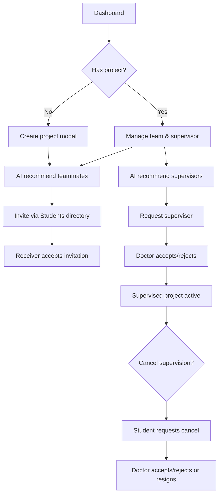
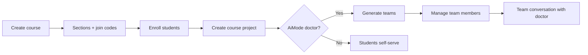

# SkillSwap — Product Specification

**Version:** 1.0  
**Date:** May 22, 2026  
**Status:** Reflects implemented product (ASP.NET Core API + React web + Expo mobile) and documented/planned items from project context.

---

## Table of Contents

1. [Executive Summary](#1-executive-summary)
2. [Product Vision & Scope](#2-product-vision--scope)
3. [User Roles](#3-user-roles)
4. [Platform Surfaces](#4-platform-surfaces)
5. [Cross-Cutting Capabilities](#5-cross-cutting-capabilities)
6. [AI Matching Engine](#6-ai-matching-engine)
7. [Authentication & Onboarding](#7-authentication--onboarding)
8. [Student Experience](#8-student-experience)
9. [Doctor Experience](#9-doctor-experience)
10. [Company Experience](#10-company-experience)
11. [Student Association Experience](#11-student-association-experience)
12. [Graduation Projects Module](#12-graduation-projects-module)
13. [Course Management Module](#13-course-management-module)
14. [Communities & Organizations (Student Discovery)](#14-communities--organizations-student-discovery)
15. [Planned & Reference-Only Features](#15-planned--reference-only-features)
16. [Navigation & Role Routing](#16-navigation--role-routing)
17. [Appendix: Route Index](#17-appendix-route-index)

---

## 1. Executive Summary

**SkillSwap** is an AI-driven academic collaboration platform that matches people to opportunities based on **skills, project needs, and structured profiles**—not social graphs. The product connects:

- **Students** (primary users) — graduation projects, course teams, org events, recruitment, messaging
- **Doctors** (supervisors/instructors) — supervision workflows, course & team management
- **Companies** — talent search with AI-ranked candidates
- **Student associations** — campus organizations, events, recruitment campaigns

**Core differentiator:** AI recommendations for teammates, supervisors, company hires, and association applicants.

**Explicit non-goals:** Not an LMS—no attendance, grades, assignments, or Zajel-style course administration beyond team formation and enrollment rosters.

---

## 2. Product Vision & Scope

### 2.1 Problem

University collaboration (graduation projects, course teams, clubs, industry hiring) is fragmented across chat apps, spreadsheets, and informal networks. Skill fit and supervisor alignment are hard to discover.

### 2.2 Solution

A single platform where:

1. Users maintain **skill-rich profiles**.
2. **Projects and requests** declare required skills and context.
3. **AI + rule-based fallbacks** rank candidates with explanations.
4. **Workflows** (invitations, supervision requests, applications) close the loop with **notifications** and **messaging**.

### 2.3 Main Modules (Implemented)

| Module | Status |
|--------|--------|
| Profile system (student, doctor, company, association) | Implemented |
| Graduation projects (student-owned) | Implemented |
| AI teammate & supervisor matching (GP) | Implemented |
| Course management & course team AI/manual flows | Implemented |
| Company AI talent search | Implemented |
| Association events & recruitment + AI applicant analysis | Implemented |
| Student org discovery (follow, public profiles) | Implemented |
| Notifications (multi-category) | Implemented |
| Direct & group messaging (SignalR) | Implemented |
| Global search (students + doctors) | Implemented |
| Legacy project reuse | **Planned** (documented in `PROJECT_CONTEXT.md`, not in API/UI) |

---

## 3. User Roles

| Role | Identifier | Primary entry route | Key capabilities |
|------|------------|---------------------|------------------|
| **Student** | `student` | `/dashboard` | Own/join GP, AI matching, courses, orgs, messaging |
| **Doctor** | `doctor` | `/doctor-dashboard` | Supervise GPs, manage courses/teams, student directory |
| **Company** | `company` | `/company/dashboard` | AI talent search, saved searches |
| **Student association** | `student_association` (and variants via `isAssociationRole`) | `/association/dashboard` | Events, recruitment, leadership roster, profile |
| **Anonymous** | — | `/`, public profile URLs | Landing, login, public student/doctor profiles |

### 3.1 Authorization Principles

- JWT bearer auth; role claim drives UI routing.
- **Two ID spaces:** API paths often use `User.Id`; graduation/course membership uses `StudentProfile.Id` / `DoctorProfile.Id`. Integrators must not mix them.
- Doctors **cannot** create or join student graduation projects; they **respond** to supervision requests only.
- Organizations, follow, and student community APIs require `student` or `studentassociation` roles.

---

## 4. Platform Surfaces

| Surface | Stack | Notes |
|---------|-------|-------|
| **Web app** | React + Vite (`frontend/`) | Primary, full feature set |
| **Mobile app** | Expo Router (`mobile/`) | Parity for student/doctor/association/company core flows |
| **API** | ASP.NET Core (`backend/GraduationProject.API/`) | REST + SignalR for chat/notifications |
| **Doctor hub reference** | `_lovable_doctor_hub/` | Design/mock target; not wired to production routes |

---

## 5. Cross-Cutting Capabilities

### 5.1 Search

**Purpose:** Quick discovery of students and doctors from any authenticated context (notably student dashboard top bar).

| Attribute | Detail |
|-----------|--------|
| **API** | `GET /api/search?query=` |
| **Results** | Up to 5 students + 5 doctors (name, email, major/specialization) |
| **Match fields** | Name, email, major, faculty, university, skill strings |
| **Navigation** | Student result → `/students/:userId`; doctor → `/doctors/:doctorId` |

**Student directory** (`/students`) is a separate, richer browse with filters—not global search.

### 5.2 Notifications

**Purpose:** In-app awareness of graduation project, course, chat, and organization activity.

| Attribute | Detail |
|-----------|--------|
| **API** | `GET /api/notifications`, `unread-count`, `POST .../read`, `read-all`, `read-scope` |
| **Categories** | `graduation_project`, `chat`, `course`, `organization_event`, `organization_recruitment` |
| **Delivery** | REST list + SignalR push (`GraduationProjectNotificationService`) |
| **Student UI** | Dashboard bell; dedicated `NotificationsPage` on mobile |
| **Doctor UI** | `/doctor/notifications` with tabs: All, Supervision, Courses, Projects, Events |

**Representative event types (graduation project):**  
`project_created`, `project_updated`, `project_deleted`, `member_joined`, `member_left`, `member_removed_*`, `leader_changed_*`, `invitation_*`, `supervision_request_*`, `supervisor_cancellation_*`, `supervision_cancelled_by_doctor`

**Course:** `course_project_*`, `course_teams_generated`, `course_team_member_*`, `course_section_enrollment_added`

**Chat:** `direct_message`, `conversation_started`, `section_message`, `team_message`

**Organization:** `organization_event`, `recruitment_application_accepted/rejected`

### 5.3 Messaging

**Purpose:** Direct messages and group threads (course teams, course sections, doctor–team).

| Attribute | Detail |
|-----------|--------|
| **Route (web)** | `/messages` |
| **API** | `GET/POST /api/conversations`, `start/{targetUserId}`, messages endpoints, `POST /api/course-teams/{teamId}/conversation` (doctor) |
| **Realtime** | SignalR hub for live message delivery |
| **UI sections** | Conversation list (left); active thread (right) |
| **Actions** | Send message; edit/unsend own messages; delete conversation |
| **Entry points** | Dashboard messages bell; student public profile **Message**; course team **Open chat with doctor**; doctor request cards → messages |
| **Query params** | `?userId=` to start DM; `location.state.conversationId` or `courseTeamId` for deep links |

### 5.4 Settings & Profile (All Roles)

Settings are **profile-centric**—no separate global settings app; each role edits via dedicated profile routes.

| Role | View route | Edit route | API |
|------|------------|------------|-----|
| Student | `/profile` | `/edit-profile` | `GET /api/me`, `PUT /api/profile` |
| Doctor | `/doctor/profile` | `/doctor/edit-profile` | `GET /api/me`, `PUT /api/profile/doctor` |
| Company | (dashboard context) | Registration-time + profile API | `GET /api/company/profile` |
| Association | `/association/profile` | Inline edit on same page | `GET/PUT /api/association` |

**Student profile strength:** Dashboard modal checklist linking to `/edit-profile` sections (completeness drives “profile strength” metrics on dashboard API).

---

## 6. AI Matching Engine

### 6.1 Design

- **Primary:** OpenAI-backed ranking services (`IAiStudentRecommendationService`) with structured project/candidate payloads.
- **Fallback:** Rule-based skill overlap scores when AI unavailable or returns no qualifying rows.
- **Minimum teammate score:** Recommendations below threshold are omitted (`MinTeammateMatchScore = 1`).

### 6.2 Capabilities by Domain

| Domain | Endpoint / flow | Who can invoke | Output |
|--------|-----------------|----------------|--------|
| **GP teammates** | `POST /api/ai/recommend-students` | Project owner or leader | Ranked students: `studentId`, `matchScore`, `reason`, skills |
| **GP supervisors** | `POST /api/ai/recommend-supervisors` | Project owner or leader | Ranked doctors: `doctorId`, `matchScore`, `reason` |
| **Course teams (student)** | `GET .../ai-team-recommendations` | Enrolled student | AI-ranked classmates for invitations |
| **Course teams (doctor)** | `POST .../generate-teams` | Doctor when `AiMode == "doctor"` | Auto-generated teams from enrolled students’ skills |
| **Company talent** | `POST /api/company/talent-search` | Company | Ranked students with explanations |
| **Association recruitment** | Analyze applicants per position | Association | AI analysis cards; accept/reject; optional regenerate with filters |

### 6.3 Business Rules (GP)

- Teammate candidates: same major as owner, not already on team, not another GP owner.
- Supervisor candidates: doctors in department matching student major; CE students also see Electrical Engineering department.
- Only **owner or team leader** may request AI lists.

---

## 7. Authentication & Onboarding

### 7.1 Landing Page

| Field | Value |
|-------|-------|
| **Page name** | Landing |
| **Route** | `/` |
| **Purpose** | Marketing and conversion to register/login |

**Sections:** Navbar, Hero, Problem/Solution, How It Works, Features, User Types, Footer.

**Actions:** Navigate to Login, Register.

**Navigation flow:** Public → `/login` or `/register`.

---

### 7.2 Login Page

| Field | Value |
|-------|-------|
| **Page name** | Login |
| **Route** | `/login` |
| **Purpose** | Authenticate and route by role |

**Form fields:** `email`, `password`; optional `remember`.

**Actions:** Submit login → store `token`, `userId`, `role`, `name`, `email` → redirect: student `/dashboard`, doctor `/doctor-dashboard`, company `/company/dashboard`, association `/association/dashboard`.

**Navigation:** Register, Forgot password.

---

### 7.3 Register Page

| Field | Value |
|-------|-------|
| **Page name** | Register |
| **Route** | `/register` |
| **Purpose** | Multi-role registration entry |

**Sections:** Step 1 — role cards (Student, Doctor, Organization, Company). Step 2 — role-specific form.

**Actions:** Select role → embedded form; Organization → `/register/association`.

---

### 7.4 Student Registration (embedded)

**Steps:** Account → Academic → Skills → Review.

| Step | Fields |
|------|--------|
| Account | `fullName`, `email`, `password`, `confirmPassword`, `profilePic` |
| Academic | `studentId`, `university`, `faculty`, `major`, `academicYear`, `gpa` |
| Skills | `roles[]`, `technicalSkills[]`, `tools[]` (+ custom skill inputs) |
| Review | Read-only summary |

**Actions:** Submit → `POST /api/auth/register/student` → home/dashboard.

---

### 7.5 Doctor Registration (embedded)

**Fields:** Name, email, password, department, faculty, specialization, experience, skills, bio, office hours, LinkedIn (per `DoctorRegisterForm`).

**API:** `POST /api/auth/register/doctor`.

---

### 7.6 Company Registration (embedded)

**Fields:** Company account and profile fields (per `CompanyRegisterForm`).

**API:** Company registration endpoint on auth controller.

---

### 7.7 Student Association Registration

| Field | Value |
|-------|-------|
| **Page name** | Association Register |
| **Route** | `/register/association` |
| **Purpose** | Onboard campus organization accounts |

**Steps:** Account → Details.

**Form fields:** `associationName`, `username`, `email`, `password`, `confirmPassword`; `description`, `faculty`, `category`, `logo`; `instagram`, `facebook`, `linkedIn`.

**Actions:** Submit → `/association/dashboard`.

---

### 7.8 Forgot / Reset Password

| Page | Route | Fields | Actions |
|------|-------|--------|---------|
| Forgot Password | `/forgot-password` | `email` | Submit → confirmation |
| Reset Password | `/reset-password?token=` | `password`, `confirmPassword` | Submit → login |

**API:** `POST /api/auth/forgot-password`, `POST /api/auth/reset-password`.

---

## 8. Student Experience

### 8.1 Student Dashboard

| Field | Value |
|-------|-------|
| **Page name** | Student Dashboard |
| **Route** | `/dashboard` |
| **Purpose** | Primary hub: graduation project, invitations, courses, search, notifications |

**Top bar components**
- Global search → students/doctors profiles
- Communities link → `/communities`
- Graduation + course invitation notification bell
- Messages bell → `/messages`
- Profile strength settings modal
- Avatar → `/profile`
- Logout

**Hero section (cards/stats)**
- Greeting, name, major, year, university, skill chips
- Stat cards: Suggested Teammates, Matched Projects, Best Match %, Team Invitations count
- Actions: **Edit Profile**, **View Full Profile**, **Browse Projects** (modal)

**Cards — left column**
- **Team Invitations:** merged graduation + course invites; Accept / Decline per row

**Cards — right column**
- **My Graduation Project:** empty state → Create; populated → name, role badge (Owner/Member), abstract, `projectType` (GP1/GP2/GP), supervisor link, required skills, member list (remove member, change leader), **Browse Students to Join**, **AI Teammate Recommendations**, **AI Supervisor Recommendations**
- **My Courses:** enrolled count; link **Manage My Courses** → `/student/courses`

**Forms — Create/Edit Graduation Project (modal)**

| Field | Type | Notes |
|-------|------|-------|
| `name` | text | Required |
| `abstract` | textarea | |
| `projectType` | select | Engineering vs IT faculty variants (GP1/GP2/GP) |
| `requiredSkills` | chip multi-select | Drives AI matching |

**Actions (graduation project)**
- Create, Edit, Delete (owner)
- Leave team (member)
- Invite via `/students?projectId=`
- Request supervisor (from AI list or doctor profile)
- Request supervisor cancellation (leader)
- Accept/decline invitations on dashboard card

**Modals**
- Profile Strength checklist
- Browse Projects (doctor-published channel projects)
- Find Teammates (AI suggestions)

**Tables:** Invitation list (inline cards, not data grid).

**Navigation flow**
- Courses → `/student/courses`
- Communities → `/communities`
- Profile → `/profile` or `/edit-profile`
- Recruit teammates → `/students?projectId={id}`

**APIs:** `/api/dashboard/summary`, `/api/graduation-projects/my`, `/api/invitations/*`, `/api/ai/*`.

---

### 8.2 Student Profile (Own)

| Field | Value |
|-------|-------|
| **Page name** | My Profile |
| **Route** | `/profile` |
| **Purpose** | View and assess completeness of own profile |

**Sections:** Header (avatar, name, badges, completeness ring); Academic Info; Organization memberships; Skills (general + major); Profile completeness tasks.

**Actions:** Edit profile → `/edit-profile`; add skills (session modal on own profile).

**Navigation:** Back to dashboard.

---

### 8.3 Student Profile (Public)

| Field | Value |
|-------|-------|
| **Page name** | Public Student Profile |
| **Route** | `/students/:studentId` |
| **Purpose** | View another student (also used when sharing profile URL) |

**Sections:** Header; tabs **About**, **Skills**, **Projects** (from `GET /api/graduation-projects?studentId=`).

**Actions:** **Message** → `/messages?userId=`.

---

### 8.4 Edit Student Profile

| Field | Value |
|-------|-------|
| **Page name** | Edit Profile |
| **Route** | `/edit-profile` |
| **Purpose** | Update matching-relevant profile data |

**Sidebar sections → form groups**

| Section | Fields |
|---------|--------|
| Basic Info | `fullName`, `bio`, `languages[]` |
| Work Style | `availability`, `lookingFor` |
| Skills | `roles[]`, `technicalSkills[]`, `tools[]` |
| Links | `github`, `linkedin`, `portfolio` |

**Actions:** Change photo; Save → `PUT /api/profile` → `/profile`.

---

### 8.5 Student Directory

| Field | Value |
|-------|-------|
| **Page name** | Students |
| **Route** | `/students` (optional `?projectId=` for invite mode) |
| **Purpose** | Browse or invite students to graduation project |

**Filters (browse mode):** `search`, `university`, `major`, `skill`, `availableOnly`.

**Cards:** Avatar, name, major, match %, skills; **View profile**; **Invite** (when `projectId` set).

**Tables:** Card grid (no server-side paginated table in UI).

**Navigation:** Profile → `/students/profile/:userId` or public URL; back to dashboard.

---

### 8.6 Student Profile (Directory detail)

| Field | Value |
|-------|-------|
| **Page name** | Student Profile Detail |
| **Route** | `/students/profile/:userId` |
| **Purpose** | Rich profile for directory drill-down |

**Sections:** Avatar, match %, major, year, bio, availability, looking for, skills, tools, languages, social links.

**Actions:** Back to `/students`; invite (context-dependent).

---

### 8.7 My Courses

| Field | Value |
|-------|-------|
| **Page name** | Student Courses |
| **Route** | `/student/courses`, `/student/courses/:courseId` |
| **Purpose** | Enrolled courses workspace |

**Layout sections**
- Sidebar: course list
- Detail tabs: **Section** | **Chat** | **Projects**

**Section tab:** Schedule, doctor info, section metadata, classmates roster.

**Chat tab:** Section conversation.

**Projects tab — cards per course project**
- Team size, section, doctor-assigned vs student-selection mode
- **View My Team** or **Generate Team**

**Actions**
- Open team → `/student/courses/:courseId/projects/:projectId/team`
- Student selection → `/student/courses/:courseId/projects/:projectId/team-choice`

**Navigation:** Back → `/dashboard`.

---

### 8.8 Course Team Generation Choice

| Field | Value |
|-------|-------|
| **Page name** | Team Generation Choice |
| **Route** | `/student/courses/:courseId/projects/:projectId/team-choice` |
| **Purpose** | Choose manual vs AI teammate discovery |

**Cards:** Build My Own Team → `manual-team`; Let AI Suggest → `ai-team`.

**Navigation:** Back to course projects tab.

---

### 8.9 Manual Course Team Building

| Field | Value |
|-------|-------|
| **Page name** | Manual Team |
| **Route** | `.../manual-team` |
| **Purpose** | Invite classmates by roster |

**Cards:** Classmate grid with **Send Invitation** per student.

**API:** `POST .../manual-team/requests/{receiverId}`.

---

### 8.10 AI Course Team Suggestions

| Field | Value |
|-------|-------|
| **Page name** | AI Team Suggestions |
| **Route** | `.../ai-team` |
| **Purpose** | Review AI-ranked teammates and invite |

**Cards:** Match %, reason, skills; **Send Invitation**.

**API:** `GET .../ai-team-recommendations`.

---

### 8.11 Course Team Invitations Inbox

| Field | Value |
|-------|-------|
| **Page name** | Team Invitations |
| **Route** | `/student/team-invitations` |
| **Purpose** | Manage pending course team invites |

**List/cards:** Project/course context; Accept / Reject.

**API:** `GET /api/courses/team-invitations`, accept/reject endpoints.

**Navigation:** Back → `/dashboard`.

---

### 8.12 Course Team Workspace

| Field | Value |
|-------|-------|
| **Page name** | My Course Team |
| **Route** | `/student/courses/:courseId/projects/:projectId/team`, `/student/team/:projectId` |
| **Purpose** | Team roster + team chat |

**Sections:** Members sidebar; team chat panel.

**Actions:** Open team chat with doctor → `/messages` with conversation state.

**API:** `GET .../my-team`, conversations, messages.

---

### 8.13 Communities Hub

| Field | Value |
|-------|-------|
| **Page name** | Communities |
| **Route** | `/communities` |
| **Purpose** | Discovery feed for campus organizations |

**Sections**
- Search + category chips
- **Suggested communities** (follow/unfollow) → Explore `/organizations`
- **Upcoming events** (feed cards → org event URLs)
- **Recruitment opportunities** (feed cards)
- **Following activity** (if following orgs) → `/following`

**Navigation:** Organizations, events, recruitment deep links.

---

### 8.14 Organizations Directory

| Field | Value |
|-------|-------|
| **Page name** | Organizations |
| **Route** | `/organizations` |
| **Purpose** | Browse and follow student organizations |

**Sections:** Following strip; Suggested; Discover grid with search/category.

**Cards:** Org avatar, name, category; **View profile**; Follow/Unfollow.

**Navigation:** `/organizations/:organizationId`.

---

### 8.15 Following Organizations

| Field | Value |
|-------|-------|
| **Page name** | Following |
| **Route** | `/following` |
| **Purpose** | Manage followed organizations |

**List:** Followed org cards; Unfollow; empty → Discover `/organizations`.

---

### 8.16 Community Events (placeholder)

| Field | Value |
|-------|-------|
| **Page name** | Community Events |
| **Route** | `/community-events` |
| **Purpose** | Placeholder — “Coming soon” aggregate events browse |

**Note:** Live events surface via Communities Hub and org public pages.

---

### 8.17 Community Recruitment (placeholder)

| Field | Value |
|-------|-------|
| **Page name** | Community Recruitment |
| **Route** | `/community-recruitment` |
| **Purpose** | Placeholder — “Coming soon” aggregate recruitment browse |

---

### 8.18 Public Organization Profile

| Field | Value |
|-------|-------|
| **Page name** | Organization Profile (public) |
| **Route** | `/organizations/:organizationId` |
| **Purpose** | Student view of org before follow/apply |

**Sections:** Hero (follow); About; Connect (social); Members; Leadership; Upcoming events; Recruitment campaigns.

**Actions:** Follow/Unfollow.

**Navigation:** Event/campaign cards → public event/campaign routes.

---

### 8.19 Public Organization Event

| Field | Value |
|-------|-------|
| **Page name** | Public Event |
| **Route** | `/organizations/:organizationId/events/:eventId` |
| **Purpose** | Event detail and student registration |

**Sections:** Cover, title, type, category, date, location, online/hybrid, capacity, registration form preview.

**Forms:** Dynamic registration fields (from org-built form).

**Actions:** Register/submit application.

---

### 8.20 Public Recruitment Campaign

| Field | Value |
|-------|-------|
| **Page name** | Public Campaign |
| **Route** | `/organizations/:organizationId/recruitment-campaigns/:campaignId` |
| **Purpose** | View positions and apply |

**Sections:** Campaign header; position list; per-position application form.

**Actions:** Submit application per position.

---

### 8.21 Messages (Student)

See [§5.3 Messaging](#53-messaging).

---

### 8.22 Doctors Directory (Student)

| Field | Value |
|-------|-------|
| **Page name** | Doctors |
| **Route** | `/doctors` |
| **Purpose** | Find supervisors |

**Filters:** Search, specialization, faculty, course filters (per `DoctorsPage`).

**Cards:** Doctor summary → `/doctors/:doctorId`.

---

## 9. Doctor Experience

### 9.1 Doctor Dashboard (shell)

| Field | Value |
|-------|-------|
| **Page name** | Doctor Dashboard |
| **Route** | `/doctor-dashboard` (`?section=overview\|requests\|projects\|courses\|deleted`) |
| **Purpose** | Unified supervision + course workspace |

**Sidebar navigation (workspace)**
- Dashboard (overview)
- My Courses
- Student Directory → `/students`
- Notifications → `/doctor/notifications`

**Sidebar navigation (supervision)**
- Supervision Requests (`?section=requests`)
- Supervised Projects (`?section=projects`)
- Cancellation Requests (same `requests` section, filtered)

**Sidebar navigation (account)**
- Removed projects (`?section=deleted`) — client localStorage archive
- Profile Settings → `/doctor/profile`

**Overview section — cards**
- Stat cards: pending requests, active supervisions, cancel requests, active students
- Pending request preview cards (Accept/Reject)
- Recent activity feed

**API:** `GET /api/doctors/me/dashboard-summary`, requests, supervised projects.

---

### 9.2 Supervision Requests Section

| Field | Value |
|-------|-------|
| **Section name** | Supervision & Cancellation Requests |
| **Route** | `/doctor-dashboard?section=requests` |
| **Purpose** | Process incoming supervision and removal requests |

**Filters:** Search (project, student, team, skills); status: Pending / All / Accepted / Rejected.

**Cards — supervision:** Project name, abstract, skills, team avatars, Accept/Reject.

**Cards — cancellation:** Project + student, Accept/Reject.

**Actions:** Accept/reject; open messages.

**API:** `GET /api/doctors/me/requests`, `GET /api/doctors/me/supervisor-cancel-requests`, POST accept/reject.

---

### 9.3 Supervised Projects Section

| Field | Value |
|-------|-------|
| **Section name** | Supervised Projects |
| **Route** | `/doctor-dashboard?section=projects` |
| **Purpose** | Monitor active graduation supervisions |

**Filters:** Search; team filter (all/full/recruiting/needs guidance); sort by fill % or recent.

**Cards:** Project name, owner, fill progress, skills, last activity, status badge.

**Actions:** Resign supervision (confirm); view project workspace.

**API:** `GET /api/doctors/me/supervised-projects`, `POST /api/doctors/me/resign-supervision/{projectId}`.

---

### 9.4 My Courses Section

| Field | Value |
|-------|-------|
| **Section name** | My Courses |
| **Route** | `/doctor-dashboard?section=courses` |
| **Purpose** | Course list and quick create |

**Cards:** Course name, code, semester, section/project counts.

**Form (quick create dialog):** `name`, `code`, `semester`.

**Actions:** Advanced setup → `/courses/create`; open → `/courses/:courseId`.

---

### 9.5 Removed Projects Section

| Field | Value |
|-------|-------|
| **Section name** | Removed Projects |
| **Route** | `/doctor-dashboard?section=deleted` |
| **Purpose** | Local archive when doctor dismisses supervision from UI |

**List fields:** `projectId`, `name`, `removedAt`.

**Note:** Not persisted server-side.

---

### 9.6 Doctor Notifications Page

| Field | Value |
|-------|-------|
| **Page name** | Doctor Notifications |
| **Route** | `/doctor/notifications` |
| **Purpose** | Full notification inbox with grouping |

**Tabs:** All, Supervision, Courses, Projects, Events.

**List items:** Title, body, group badge, read state.

**Actions:** Mark one read; mark group read; mark all read; click → contextual navigation.

---

### 9.7 Doctor Profile (view)

| Field | Value |
|-------|-------|
| **Page name** | Doctor Profile |
| **Route** | `/doctor/profile`, `/doctors/:doctorId` (public) |
| **Purpose** | Display credentials and supervised context |

**Sections:** Hero; tabs About / Courses & projects (public); academic info, contact, technical & research skills.

**Actions (own):** Edit → `/doctor/edit-profile`; (public) Message.

---

### 9.8 Edit Doctor Profile

| Field | Value |
|-------|-------|
| **Page name** | Edit Doctor Profile |
| **Route** | `/doctor/edit-profile` |
| **Purpose** | Update supervisor profile for matching |

**Form fields:** `fullName`, `bio`, `department`, `faculty`, `specialization`, `linkedin`, `officeHours`, `yearsOfExperience`, profile picture, `technicalSkills[]`, `researchSkills[]`.

**Actions:** Save → `PUT /api/profile/doctor` → `/doctor/profile`.

---

### 9.9 Create Course

| Field | Value |
|-------|-------|
| **Page name** | Create Course |
| **Route** | `/courses/create` |
| **Purpose** | Full course setup |

**Form fields:** `name`, `code`, `semester`; `useSharedProjectAcrossSections`; `allowCrossSectionTeams` (when shared).

**Navigation:** Back → courses section on dashboard.

---

### 9.10 Course Workspace

| Field | Value |
|-------|-------|
| **Page name** | Course Workspace |
| **Route** | `/courses/:courseId` |
| **Purpose** | Manage sections, projects, settings |

**Tabs:** Sections | Projects | Settings (local UI toggles: cross-section teams, AI assignment, student teammate choice, multi-project, deadlines).

**Sections panel — actions:** Create section; copy join code; manage students → `/courses/:courseId/sections/:sectionId/students`.

**Projects panel — cards:** Project list; create → `/courses/:courseId/projects/create`; teams → `/courses/:courseId/projects/:projectId/teams`; generate teams (doctor AI mode).

---

### 9.11 Section Students (Roster)

| Field | Value |
|-------|-------|
| **Page name** | Section Students |
| **Route** | `/courses/:courseId/sections/:sectionId/students` |
| **Purpose** | Enroll/remove students in section |

**Table/list:** Student name, university ID, major.

**Form:** Add students by profile IDs (`AddSectionStudentsDto`).

**Actions:** Add, remove from section.

---

### 9.12 Create Course Project

| Field | Value |
|-------|-------|
| **Page name** | Create Course Project |
| **Route** | `/courses/:courseId/projects/create` |
| **Purpose** | Define course-linked team project |

**Form fields:** `title`, `abstract`, `teamSize`, `duration`; section scope (`allSections` or `sectionId`); `allowCrossSectionTeams`; `aiMode` (`doctor` \| `student`); optional file upload label.

**Actions:** Submit → course workspace projects tab.

---

### 9.13 Project Teams (doctor)

| Field | Value |
|-------|-------|
| **Page name** | Project Teams |
| **Route** | `/courses/:courseId/projects/:projectId/teams` |
| **Purpose** | View generated teams; drill into management |

**Cards/sections:** Team index list with member counts.

**Actions:** Open team → `/doctor/projects/:projectId/teams/:teamId`; generate teams (doctor AI mode).

---

### 9.14 Team Management

| Field | Value |
|-------|-------|
| **Page name** | Team Management |
| **Route** | `/doctor/projects/:projectId/teams/:teamId` |
| **Purpose** | Edit single team roster |

**Table/list:** Members with skills.

**Form:** Add member by university ID.

**Actions:** Add member, remove member, open team conversation.

---

### 9.15 Student Directory (doctor context)

Same as [§8.5](#85-student-directory) with doctor hub shell; used for discovery and context when supervising.

---

### 9.16 Project Workspace (legacy route)

| Field | Value |
|-------|-------|
| **Page name** | Project Workspace |
| **Route** | `/project/:projectId` |
| **Purpose** | Alternate GP workspace with AI student suggestions |

**Tabs:** Overview, AI suggestions, team, supervisor.

**Note:** Mixed production API + placeholder UI; prefer dashboard for primary student GP UX.

---

### 9.17 Browse Graduation Projects (planned — Lovable reference)

**Reference only:** `BrowseGraduationProjects.tsx` in `_lovable_doctor_hub` — discover all student GPs (`GET /api/graduation-projects`). Not in production `App.tsx` routes today; doctors can browse via API-backed flows in dashboard/supervised views.

---

## 10. Company Experience

### 10.1 Company Dashboard

| Field | Value |
|-------|-------|
| **Page name** | Company Dashboard |
| **Route** | `/company/dashboard` |
| **Purpose** | Home for hiring teams |

**Layout:** `CompanyDashboardLayout` + sidebar (Overview, AI Talent Search).

**Sections**
- Welcome hero + CTA → talent search
- Stat cards: industry, recent search count
- **Recent talent searches** list (title, engagement, skills snippet, date)

**Actions:** New search → `/company/talent-search`; open past result (session).

**API:** `GET /api/company/profile`, `GET /api/company/talent-requests`.

---

### 10.2 AI Talent Search

| Field | Value |
|-------|-------|
| **Page name** | Talent Search |
| **Route** | `/company/talent-search` |
| **Purpose** | Define role need and run AI match |

**Form fields**

| Field | Required | Notes |
|-------|----------|-------|
| `title` | Yes | Role title |
| `description` | Yes | Min 20 characters |
| `requiredSkills` | Yes | Tag input, at least one |
| `engagementType` | No | Internship, GP collaboration, part-time, etc. |
| `preferredMajor` | No | Select from major list |
| `duration` | No | Free text |

**Actions:** Submit → save session → `/company/talent-search/results`.

**API:** `POST /api/company/talent-search` (`saveRequest: true`).

---

### 10.3 Talent Search Results

| Field | Value |
|-------|-------|
| **Page name** | Talent Search Results |
| **Route** | `/company/talent-search/results` |
| **Purpose** | Review ranked candidates |

**Cards:** Rank, match score, AI explanation, link to student profile.

**Actions:** Back to search; refine search.

**Data source:** Session storage from last search (redirect if empty).

---

## 11. Student Association Experience

**Layout:** `AssociationDashboardLayout` + `AssociationSidebar`: Dashboard, Events, Recruitment, Leadership Team, Profile.

### 11.1 Association Dashboard

| Field | Value |
|-------|-------|
| **Page name** | Association Dashboard |
| **Route** | `/association/dashboard` |
| **Purpose** | Org operations home |

**Sections:** Welcome (avatar, faculty, category, verified); profile summary card; quick actions (create event, my events, leadership team, recruitment). Discovery quick action disabled in UI.

**Navigation:** Events list, recruitment list, team members, profile.

---

### 11.2 Association Profile

| Field | Value |
|-------|-------|
| **Page name** | Association Profile |
| **Route** | `/association/profile` |
| **Purpose** | Public org identity management |

**View sections:** Header, about, social links.

**Edit form fields:** `associationName`, `username`, `description`, `faculty`, `category`, logo upload, `instagram`, `facebook`, `linkedIn`.

**API:** `GET/PUT /api/association`, logo upload endpoint.

---

### 11.3 Events List

| Field | Value |
|-------|-------|
| **Page name** | Organization Events |
| **Route** | `/organization/events` |
| **Purpose** | Manage campus events |

**Cards grid:** Cover, title, date, type, registration stats.

**Actions:** Create → `/organization/events/create`; View, Edit, Delete, Registration form builder.

---

### 11.4 Create / Edit Event

| Field | Value |
|-------|-------|
| **Page name** | Event Form |
| **Routes** | `/organization/events/create`, `/organization/events/:eventId/edit` |
| **Purpose** | CRUD event metadata |

**Form fields (`OrganizationEventForm`)**

| Field | Validation |
|-------|------------|
| `title` | Required |
| `description` | Required |
| `eventType` | Required (enum list) |
| `category` | Required (enum list) |
| `location` | Optional |
| `isOnline` | Boolean |
| `eventDate` | Required |
| `registrationDeadline` | Must be ≤ event date |
| `maxParticipants` | Optional positive integer |
| `coverImageUrl` | Optional upload |

**Actions:** Save; Cancel to list or details.

---

### 11.5 Event Details

| Field | Value |
|-------|-------|
| **Page name** | Event Details |
| **Route** | `/organization/events/:eventId` |
| **Purpose** | Operational view for org admins |

**Sections:** Cover, metadata, registration stats, links to edit and registration form.

**Actions:** Edit; open registration form builder; delete.

---

### 11.6 Event Registration Form Builder

| Field | Value |
|-------|-------|
| **Page name** | Event Registration Form |
| **Route** | `/organization/events/:eventId/registration-form` |
| **Purpose** | Define custom fields students fill when registering |

**Components:** `EventRegistrationFormEditor` — dynamic field types (text, select, etc.).

**Actions:** Add/remove/reorder fields; save.

---

### 11.7 Leadership Team

| Field | Value |
|-------|-------|
| **Page name** | Organization Team Members |
| **Route** | `/organization/team-members` |
| **Purpose** | Public leadership roster on org profile |

**Form fields:** `fullName`, `roleTitle`, `major`, image upload, `linkedIn`, `displayOrder`.

**Table/list:** Members with edit/delete; optional pick from org roster.

**API:** `/api/organization/team-members`.

---

### 11.8 Recruitment Campaigns List

| Field | Value |
|-------|-------|
| **Page name** | Recruitment Campaigns |
| **Route** | `/organization/recruitment-campaigns` |
| **Purpose** | Manage hiring/volunteer drives |

**Cards:** Title, deadline, published state, position count.

**Actions:** Create, view, edit, delete.

---

### 11.9 Create / Edit Campaign

| Field | Value |
|-------|-------|
| **Page name** | Campaign Form |
| **Routes** | `.../create`, `.../:campaignId/edit` |
| **Purpose** | Campaign metadata + positions |

**Form fields:** `title`, `description`, `applicationDeadline`, `coverImage`, `isPublished`; positions editor (`title`, `description`, `skills`, `slots`, etc.).

---

### 11.10 Campaign Details (org admin)

| Field | Value |
|-------|-------|
| **Page name** | Campaign Details |
| **Route** | `/organization/recruitment-campaigns/:campaignId` |
| **Purpose** | Review applications and run AI analysis |

**Sections:** Campaign header; positions list; applications per position; AI analysis panel.

**Cards:** `AiRecruitmentCandidateCard` — match score, explanation.

**Forms (regenerate AI modal):** `regenerateSkills`, `regenerateMajors`, `regenerateMinMatch`, `regenerateExcludeRejected`.

**Actions:** Analyze applicants; regenerate analysis; accept/reject application; edit position form → `.../positions/:positionId/form`.

**Application statuses:** Pending, AiSuggested, Accepted, Rejected.

---

### 11.11 Position Application Form Builder

| Field | Value |
|-------|-------|
| **Page name** | Position Application Form |
| **Route** | `.../positions/:positionId/form` |
| **Purpose** | Custom questions per position |

**Components:** `PositionApplicationFormEditor` / `recruitmentApplicationFormBuilderUi`.

---

### 11.12 Application Detail

| Field | Value |
|-------|-------|
| **Page name** | Application Detail |
| **Route** | `.../applications/:applicationId` |
| **Purpose** | Full Q&A review for one applicant |

**Sections:** Applicant info; answers table; status controls.

**Actions:** Accept, reject, mark AI suggested.

---

## 12. Graduation Projects Module

### 12.1 Conceptual Model

- One **student-owned** graduation project per owner (enforced by business rules).
- **Members** join via invitation or join flow; roles: owner, leader, member.
- **Supervisor** optional; assigned when doctor accepts supervision request.
- **Required skills** on project drive all AI matching.

### 12.2 Student User Flows

### 12.3 Team Invitations (Graduation)

| Attribute | Detail |
|-----------|--------|
| **API** | `GET /api/invitations/received`, `sent/{projectId}`, `POST /api/invitations/{id}/accept`, decline/cancel flows |
| **UI** | Dashboard Team Invitations card; merged with course invites in places |
| **Rules** | Only owner sends; receiver accepts; notifications on each transition |

### 12.4 Supervisor Matching Flow

| Step | Actor | Action |
|------|-------|--------|
| 1 | Student (leader/owner) | `POST .../request-supervisor/{doctorId}` or pick from AI list |
| 2 | Doctor | `GET /api/doctors/me/requests` → Accept/Reject |
| 3 | System | Sets `SupervisorId`; auto-rejects other pending requests for same project |
| 4 | Student | Optional `request-supervisor-cancel` |
| 5 | Doctor | Accept/reject cancel or `resign-supervision` |

### 12.5 Discovery & Browse

- `GET /api/graduation-projects` — all projects; filters `studentId`, `doctorId` (User.Id for doctor filter).
- Student **Browse Projects** modal — doctor-published channel projects (legacy channel model on dashboard).
- Doctors browse supervised set via dashboard; full browse page planned in Lovable reference.

### 12.6 Team Chat (Graduation)

- `TeamChatController` — **student role only** for GP team channels.
- Separate from course team and direct messaging.

---

## 13. Course Management Module

### 13.1 Purpose

Support **instructor-led team formation** for course projects—not full LMS. Doctors create courses, sections, enroll students, define projects, and either **auto-generate teams (AI)** or let **students self-serve** manual/AI invitations.

### 13.2 AiMode

| Mode | Doctor | Student |
|------|--------|---------|
| `doctor` | Creates teams via `generate-teams`; manages roster | Views assigned team |
| `student` | Defines project only | Manual or AI invitations, accept/reject invites |

### 13.3 Doctor User Flow

### 13.4 Student User Flow

See [§8.7–§8.12](#87-my-courses).

### 13.5 Team Invitations (Course)

| API | Purpose |
|-----|---------|
| `GET /api/courses/team-invitations` | Pending invites for current student |
| `POST .../team-invitations/{id}/accept` | Join team |
| `POST .../reject` | Decline |
| `POST .../manual-team/requests/{receiverId}` | Send invite (manual path) |

---

## 14. Communities & Organizations (Student Discovery)

### 14.1 Follow Model

- Students **follow** organizations → feed on Communities Hub and Following page.
- API: `OrganizationsController` follow/unfollow.

### 14.2 Feed Composition

| Feed item | Source |
|-----------|--------|
| Suggested orgs | Discovery API |
| Upcoming events | Followed + public org events |
| Recruitment | Published campaigns |
| Following activity | Recent actions from followed orgs |

### 14.3 Student vs Association Views

| Capability | Student | Association |
|------------|---------|-------------|
| View public org profile | Yes | N/A (owns profile) |
| Register for event | Yes | Manages event |
| Apply to recruitment | Yes | Reviews applications |
| Create events/campaigns | No | Yes |

---

## 15. Planned & Reference-Only Features

| Feature | Source | Status |
|---------|--------|--------|
| **Legacy graduation projects** — AI reuse/improvement of past projects with reviewer feedback | `PROJECT_CONTEXT.md` | Not implemented in API/UI |
| **Community Events / Recruitment aggregate pages** | `/community-events`, `/community-recruitment` | Placeholder UI only |
| **Doctor browse all graduation projects** | Lovable `BrowseGraduationProjects.tsx` | Reference mock |
| **Doctor channel workspace** | `/doctor/channels/:id` | Redirects to dashboard |
| **DoctorProjectDetailsPage**, **DoctorCourseManagePage** | In codebase | Not routed in `App.tsx` |
| **Association Discovery** quick action | Association dashboard | Disabled in UI |
| **Course workspace settings tab** | Local-only toggles | Partially UI-only, not all persisted |

---

## 16. Navigation & Role Routing

Protected routes check `localStorage.role` and redirect:

| If role is | Accessing student route | Redirect |
|------------|-------------------------|----------|
| `doctor` | `/dashboard`, `/profile`, communities | `/doctor-dashboard` |
| `student_association` | student routes | `/association/dashboard` |
| `company` | student routes | `/company/dashboard` |
| `student` | doctor/company/association routes | `/dashboard` or `/` |

Post-login destinations are enforced on Login and via per-route wrapper components in `App.tsx`.

---

## 17. Appendix: Route Index

### Public

| Route | Page |
|-------|------|
| `/` | Landing |
| `/login` | Login |
| `/register` | Register |
| `/register/association` | Association register |
| `/forgot-password` | Forgot password |
| `/reset-password` | Reset password |
| `/students/:studentId` | Public student profile |
| `/doctors/:doctorId` | Public doctor profile |

### Student (protected)

| Route | Page |
|-------|------|
| `/dashboard` | Dashboard |
| `/profile`, `/edit-profile` | Profile / edit |
| `/student/courses`, `/student/courses/:courseId` | Courses |
| `/student/courses/.../team-choice` | Team mode choice |
| `/student/courses/.../manual-team` | Manual team |
| `/student/courses/.../ai-team` | AI team |
| `/student/courses/.../team`, `/student/team/:projectId` | Team workspace |
| `/student/team-invitations` | Course invitations |
| `/messages` | Chat |
| `/communities` | Communities hub |
| `/organizations` | Org directory |
| `/following` | Following |
| `/community-events`, `/community-recruitment` | Placeholders |
| `/organizations/:id`, `.../events/:eventId`, `.../recruitment-campaigns/:campaignId` | Public org views |
| `/students`, `/students/profile/:userId` | Directory |
| `/doctors` | Doctors directory |

### Doctor (protected)

| Route | Page |
|-------|------|
| `/doctor-dashboard` | Dashboard sections |
| `/doctor/notifications` | Notifications |
| `/doctor/profile`, `/doctor/edit-profile` | Profile |
| `/courses/create`, `/courses/:courseId` | Course CRUD workspace |
| `/courses/:courseId/sections/:sectionId/students` | Roster |
| `/courses/:courseId/projects/create` | Create project |
| `/courses/:courseId/projects/:projectId/teams` | Teams list |
| `/doctor/projects/:projectId/teams/:teamId` | Team management |
| `/project/:projectId` | Legacy workspace |
| `/students`, `/students/profile/:userId` | Directory (shared) |

### Company (protected)

| Route | Page |
|-------|------|
| `/company/dashboard` | Dashboard |
| `/company/talent-search` | Search form |
| `/company/talent-search/results` | Results |

### Association (protected)

| Route | Page |
|-------|------|
| `/association/dashboard` | Dashboard |
| `/association/profile` | Profile |
| `/organization/events` (+ create, `:eventId`, edit, registration-form) | Events |
| `/organization/team-members` | Leadership |
| `/organization/recruitment-campaigns` (+ create, detail, edit, position form, application detail) | Recruitment |

### Mobile (Expo) — parallel screens

`dashboard`, `doctor-dashboard`, `courses`, `organization/*`, `company/*`, `communities`, `organizations`, `following`, `ChatPage`, `NotificationsPage`, `StudentsPage`, profile variants, team flow screens — see `mobile/app/_layout.tsx`.

---

## Document Control

| Item | Value |
|------|-------|
| **Sources** | `frontend/src/app/App.tsx`, page components, `backend/GraduationProject.API/Controllers/*`, `docs/PROJECT_CONTEXT.md`, `docs/DOCTOR_STUDENT_BACKEND_CAPABILITIES.md` |
| **Maintainers** | Update when routes, roles, or API contracts change |
| **Out of scope** | Implementation code, deployment, test plans |

---

*End of Product Specification*
